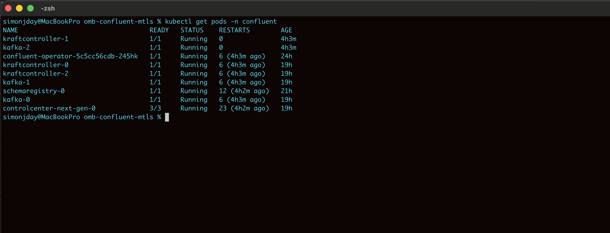
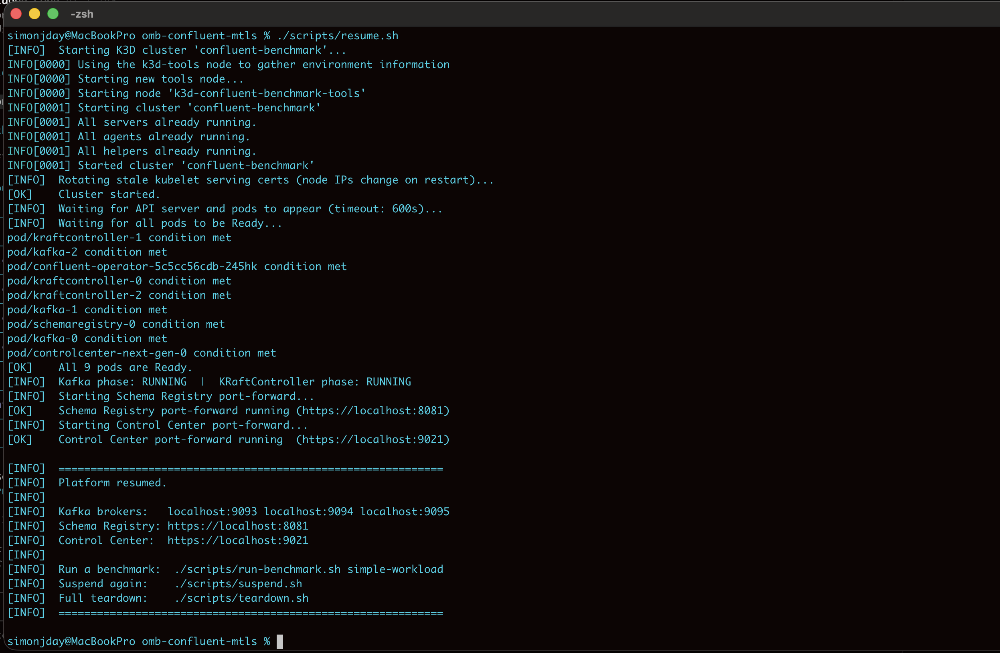
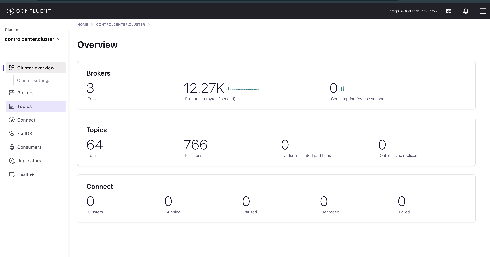
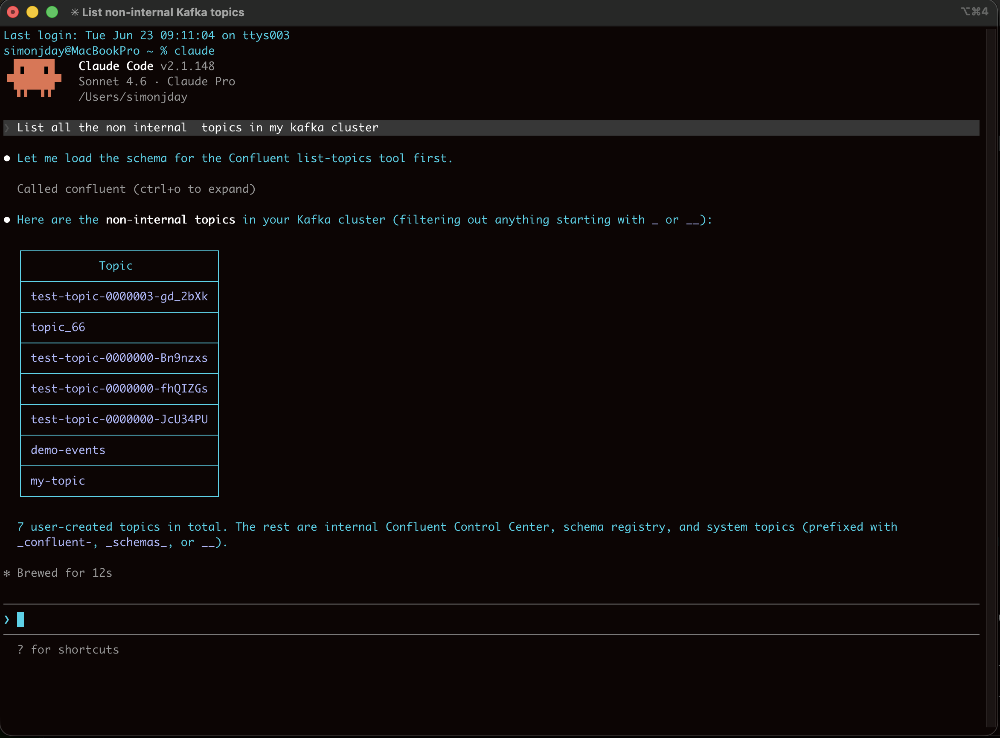

# OMB Confluent mTLS

A fully automated benchmark platform for load-testing an **mTLS-enabled Confluent Platform** cluster running in K3D (Docker-based Kubernetes), using **Open Messaging Benchmark (OMB)**. Pure KRaft mode — no ZooKeeper.

---

## Architecture

```
Docker Desktop (VM)
  K3D cluster (Docker containers acting as K8s nodes)
    confluent namespace
      KRaftController x3  — Raft quorum, no ZooKeeper
      Kafka broker x3     — mTLS, NodePorts 9093-9096

  Docker Compose (host network)
    omb-worker-1  :8080
    omb-worker-2  :8082
    omb-worker-3  :8084
    omb-driver    (orchestrates workers, connects to Kafka via mTLS)
```

All OMB containers use `network_mode: host` and mount `certs/` with JKS keystores.

**Key design decisions:**

| Component | Choice | Reason |
|-----------|--------|--------|
| Metadata quorum | **KRaft** (`KRaftController` CR) | No ZooKeeper dependency |
| TLS | **mTLS end-to-end** | CA → controllers → brokers → clients |
| Cluster | **K3D** (Docker-based K8s) | Runs on a laptop |
| Operator | **CFK** (Confluent for Kubernetes) | Manages Kafka lifecycle |
| Benchmarking | **OMB** (Open Messaging Benchmark) | Industry-standard load testing |
| OMB image | **Single unified `omb:latest`** | Worker and driver from one build |

---

## Prerequisites

| Tool | Minimum version | Install |
|------|----------------|---------|
| Docker Desktop | 24.x | https://docs.docker.com/get-docker/ |
| k3d | 5.6.x | `brew install k3d` |
| kubectl | 1.28+ | https://kubernetes.io/docs/tasks/tools/ |
| Helm | 3.14+ | https://helm.sh/docs/intro/install/ |
| OpenSSL | 3.x | Usually pre-installed |
| Java keytool | 17+ | Included with JDK |

---

## Quick Start

```bash
git clone https://github.com/simonjday/omb-confluent-mtls.git
cd omb-confluent-mtls
./scripts/setup-all.sh
```

This creates the K3D cluster, installs the CFK operator via Helm, generates all certificates, loads them into Kubernetes secrets, deploys the KRaftController and Kafka StatefulSets, and builds the OMB Docker image.



### Run benchmarks

```bash
./scripts/run-benchmark.sh simple-workload   # smoke test (1k msg/s, 2 min)
./scripts/run-benchmark.sh low-latency       # p99 latency focus (500 msg/s)
./scripts/run-benchmark.sh high-throughput   # 100k msg/s, 4 topics
./scripts/run-benchmark.sh endurance         # 30-min stability
```

### Review results

```bash
./scripts/collect-results.sh                        # all results in results/
./scripts/collect-results.sh results/foo.json       # specific file
./scripts/collect-results.sh --compare              # side-by-side comparison table
```

Prints per-workload throughput, latency histograms, and pass/fail assessments. Also available as `python3 scripts/review-results.py` with the same arguments.

### Teardown

```bash
./scripts/teardown.sh              # stop containers + delete cluster
./scripts/teardown.sh --all        # also remove certs/ and results/
```

### Hibernate and resume

```bash
./scripts/suspend.sh   # stop the K3D cluster (saves Docker state, frees RAM)
./scripts/resume.sh    # restart cluster, wait for all pods Ready, restore port-forwards
```



---

## Kafka External Access

The K3D loadbalancer proxies each port directly to the matching NodePort on K3D agent nodes. CFK's `nodePortOffset: 9093` aligns Kafka NodePort values with these mappings.

| Broker | Host port | NodePort |
|--------|-----------|----------|
| kafka-0 | 9093 | 9093 |
| kafka-1 | 9094 | 9094 |
| kafka-2 | 9095 | 9095 |
| kafka-3 | 9096 | 9096 |

---

## Connecting a Client

After setup, any Kafka client can connect to `localhost:9093`. Certs are in `certs/` after running `generate-certs.sh`.

### kcat

```bash
# List topics (OMB auto-generates topic names — list first to find them)
kcat -b localhost:9093 \
  -X security.protocol=SSL \
  -X ssl.ca.location=certs/ca/ca.crt \
  -X ssl.certificate.location=certs/client/client.crt \
  -X ssl.key.location=certs/client/client.key \
  -L 2>/dev/null | grep "topic "

# Consume (replace <topic> with the name from the list above)
kcat -b localhost:9093 \
  -X security.protocol=SSL \
  -X ssl.ca.location=certs/ca/ca.crt \
  -X ssl.certificate.location=certs/client/client.crt \
  -X ssl.key.location=certs/client/client.key \
  -C -t <topic> -o beginning
```

### kafka-console-consumer

Create `client.properties`:

```properties
security.protocol=SSL
ssl.keystore.location=certs/client/client.keystore.jks
ssl.keystore.password=changeit
ssl.key.password=changeit
ssl.truststore.location=certs/client/client.truststore.jks
ssl.truststore.password=changeit
```

Then:

```bash
kafka-console-consumer \
  --bootstrap-server localhost:9093 \
  --consumer.config client.properties \
  --topic <topic> --from-beginning
```

---

## Optional: Schema Registry and Control Center Next Gen

Schema Registry and Control Center Next Gen (with embedded Prometheus and AlertManager) can be deployed on top of the running Kafka cluster. These are optional — not required for benchmarking.

```bash
./scripts/deploy-optional.sh
```

This script:
1. Generates TLS certificates for Schema Registry, Control Center, and Prometheus/AlertManager (signed by the existing CA)
2. Creates six Kubernetes secrets: `schemaregistry-tls`, `controlcenter-tls`, `prometheus-tls`, `alertmanager-tls`, `prometheus-client-tls`, `alertmanager-client-tls`
3. Deploys Schema Registry and Control Center Next Gen CRs and waits for them to be ready
4. Patches the Kafka and KRaft CRs to send KIP-714 telemetry metrics to Prometheus
5. Starts `kubectl port-forward` processes so both UIs are reachable on localhost

Once running:

| Component | URL | Notes |
|-----------|-----|-------|
| Schema Registry | https://localhost:8081 | — |
| Control Center Next Gen | https://localhost:9021 | — |

Both use self-signed certificates — accept the browser warning on first visit.

```bash
# Test Schema Registry
curl -k https://localhost:8081/subjects

# Browse to https://localhost:9021 — broker and controller metrics appear in the UI

# Stop port-forwards
pkill -f "port-forward svc/schemaregistry"
pkill -f "port-forward svc/controlcenter-next-gen"

# Remove optional components entirely
kubectl delete -f confluent/optional/
kubectl delete secret schemaregistry-tls controlcenter-tls \
  prometheus-tls alertmanager-tls \
  prometheus-client-tls alertmanager-client-tls -n confluent
```



> **Memory:** Control Center Next Gen needs ~4 GB on top of the Kafka cluster. Make sure Docker Desktop has at least 16 GB allocated before deploying it.

### Why metrics use TLS, not mTLS

Kafka brokers and KRaft controllers send KIP-714 telemetry to Control Center's embedded Prometheus over HTTPS. The telemetry is handled by a Confluent-shaded asynchttpclient inside `cp-server`. In version 7.7.0 (used here), this shaded client creates its own SSLContext for the OTLP POST and **does not honour** the `ssl.truststore.*` Kafka properties for server-certificate verification — it uses the JVM default trust store instead. This means:

- Prometheus is configured for **TLS only** (no client-certificate requirement). The `KAFKA_OPTS` environment variable injects our CA into the JVM trust chain so the shaded client can verify Prometheus's server cert.
- Full **mTLS** (mutual certificate verification between broker and Prometheus) works in `cp-server` 7.9+. Upgrading the `cp-server` image version in `confluent/confluent-platform.yaml` and changing `metricsClient.authentication.type: mtls` in the patch inside `scripts/deploy-optional.sh` would enable it.

---

## Benchmarking a Remote Cluster

To target a remote cluster instead of K3D, skip `setup-all.sh` and just start the OMB workers:

```bash
docker build -t omb:latest docker/
docker compose -f docker/docker-compose.yml up omb-worker-1 omb-worker-2 omb-worker-3 -d
```

Update `omb/driver-kafka.yaml` with your cluster's bootstrap servers and auth config, then run benchmarks as normal.

---

## Configuration

### Environment variables (`.env` file, gitignored)

```bash
KAFKA_BOOTSTRAP_SERVERS=localhost:9093,localhost:9094,localhost:9095,localhost:9096
KEYSTORE_PASSWORD=changeit
TRUSTSTORE_PASSWORD=changeit
KEY_PASSWORD=changeit
```

### TLS certificate options

| Variable | Default | Description |
|----------|---------|-------------|
| `KEYSTORE_PASSWORD` | `changeit` | JKS keystore password |
| `TRUSTSTORE_PASSWORD` | `changeit` | JKS truststore password |
| `KEY_PASSWORD` | `changeit` | Private key password |
| `CERT_VALIDITY_DAYS` | `3650` | Certificate validity in days |

---

## Workload Customisation

Workload files are in `omb/workloads/`. All fields are standard OMB parameters:

| Field | Description |
|-------|-------------|
| `topics` | Number of Kafka topics |
| `partitionsPerTopic` | Partitions per topic |
| `messageSize` | Message size in bytes |
| `producersPerTopic` | Producers per topic |
| `producerRate` | Target publish rate (msg/s) |
| `consumerPerSubscription` | Consumers per subscription |
| `warmupDurationMinutes` | Warm-up period (excluded from results) |
| `testDurationMinutes` | Test duration |

---

## Confluent MCP Server (AI-Assisted Kafka Management)

Once the cluster is running, you can connect the [Confluent MCP server](https://github.com/confluentinc/mcp-confluent) to interact with your Kafka cluster using natural language — via Claude Code, VS Code Copilot Chat, or Claude Desktop.

### Install

```bash
mkdir -p ~/kafka-mcp-server && cd ~/kafka-mcp-server
cat > package.json << 'EOF'
{ "dependencies": { "@confluentinc/mcp-confluent": "latest" } }
EOF
npm install
```

### Configure (`config.yaml`)

```yaml
server:
  transports: [stdio]
  log_level: info

connections:
  k3d-mtls:
    type: direct
    kafka:
      bootstrap_servers: "localhost:9093,localhost:9094,localhost:9095"
      extra_properties:
        security.protocol: "SSL"
        ssl.ca.location: "/path/to/omb-confluent-mtls/certs/ca/ca.crt"
        ssl.certificate.location: "/path/to/omb-confluent-mtls/certs/client/client.crt"
        ssl.key.location: "/path/to/omb-confluent-mtls/certs/client/client.key"
        ssl.endpoint.identification.algorithm: "none"
    schema_registry:
      endpoint: "https://localhost:8081"
      auth:
        type: api_key
        key: "local"
        secret: "local"
```

Replace `/path/to/` with the absolute path to this repo.

### Register with Claude Code

```bash
claude mcp add confluent -s user \
  -e NODE_EXTRA_CA_CERTS=/path/to/omb-confluent-mtls/certs/ca/ca.crt \
  -- node ~/kafka-mcp-server/node_modules/@confluentinc/mcp-confluent/dist/index.js \
  --config ~/kafka-mcp-server/config.yaml
```

Verify: `claude mcp list` should show `confluent: ✓ Connected`.

### Register with VS Code Copilot Chat

Add to `~/.config/Code/User/settings.json` (or `~/Library/Application Support/Code/User/settings.json` on macOS):

```json
"mcp.servers": {
  "confluent": {
    "type": "stdio",
    "command": "node",
    "args": [
      "/Users/<you>/kafka-mcp-server/node_modules/@confluentinc/mcp-confluent/dist/index.js",
      "--config", "/Users/<you>/kafka-mcp-server/config.yaml"
    ],
    "env": { "NODE_EXTRA_CA_CERTS": "/path/to/omb-confluent-mtls/certs/ca/ca.crt" }
  }
}
```

### Example prompts

```
List all non-internal kafka topics in my cluster
Describe the consumer groups consuming from test-topic-*
What is the current lag on consumer group X?
Produce a test message to topic demo-events
```



---

## Troubleshooting

### mTLS handshake failures

```bash
openssl verify -CAfile certs/ca/ca.crt certs/client/client.crt
openssl s_client -connect localhost:9093 \
  -cert certs/client/client.crt \
  -key certs/client/client.key \
  -CAfile certs/ca/ca.crt
```

Re-generate certs if needed: `./confluent/mtls/generate-certs.sh && ./confluent/mtls/create-k8s-secrets.sh`

### KRaft controller stuck

```bash
kubectl logs -n confluent kraftcontroller-0
kubectl describe kraftcontroller kraftcontroller -n confluent
```

### Certificate expiry

```bash
CERT_VALIDITY_DAYS=365 ./confluent/mtls/generate-certs.sh
./confluent/mtls/create-k8s-secrets.sh
kubectl rollout restart statefulset/kafka statefulset/kraftcontroller -n confluent
```

---

## Directory Structure

```
omb-confluent-mtls/
├── docker/
│   ├── Dockerfile                # Unified OMB image (worker + driver)
│   └── docker-compose.yml        # 3 workers + 1 driver
├── k3d/
│   ├── k3d-cluster-config.yaml   # Cluster config (NodePort range 9000-32767)
│   └── setup-k3d.sh              # Creates cluster + installs CFK via Helm
├── confluent/
│   ├── confluent-platform.yaml   # KRaftController + Kafka CRs
│   ├── optional/
│   │   ├── schema-registry.yaml  # Schema Registry CR (optional)
│   │   └── control-center.yaml   # Control Center CR (optional)
│   └── mtls/
│       ├── openssl.cnf           # OpenSSL config with SANs
│       ├── generate-certs.sh     # Generates CA, broker, controller, client certs + JKS
│       └── create-k8s-secrets.sh # Loads certs into K8s secrets
├── omb/
│   ├── driver-kafka.yaml         # Kafka driver config (bootstrap servers, mTLS paths)
│   ├── workers.yaml              # Worker HTTP endpoints
│   └── workloads/                # Workload YAML files
├── scripts/
│   ├── setup-all.sh              # Full end-to-end setup
│   ├── run-benchmark.sh          # Start workers + run workload
│   ├── collect-results.sh        # Summarise benchmark JSON output (shell wrapper)
│   ├── review-results.py         # Analyse OMB JSON output (Python, called by above)
│   ├── deploy-optional.sh        # Deploy Schema Registry + Control Center Next Gen
│   └── teardown.sh               # Stop containers + delete cluster
├── certs/                        # Generated certs (gitignored)
└── results/                      # Benchmark JSON output (gitignored)
```
